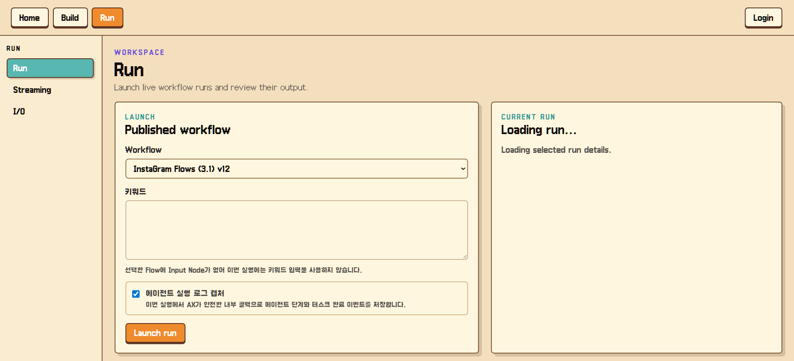
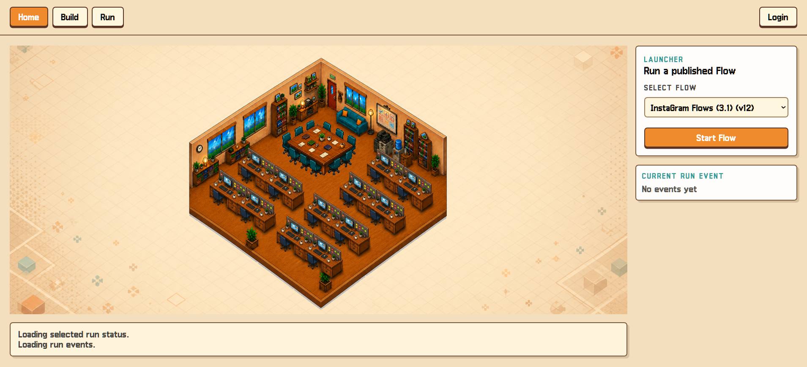
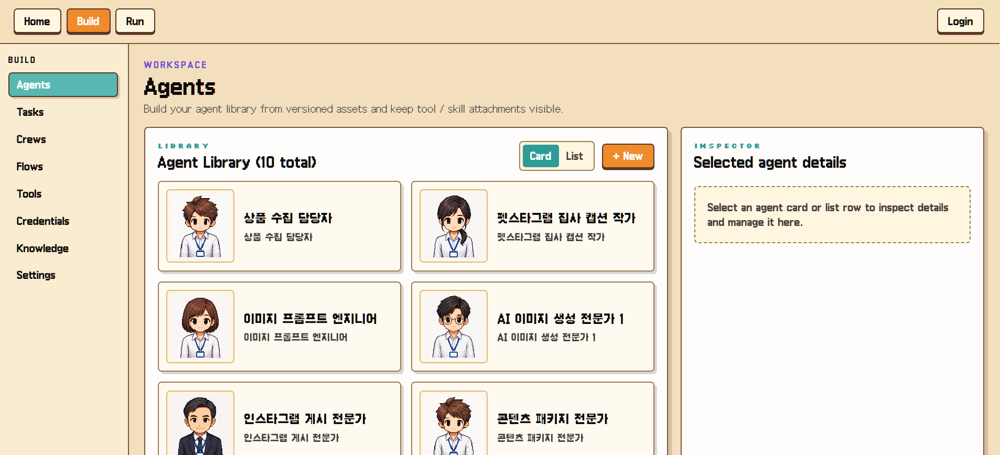
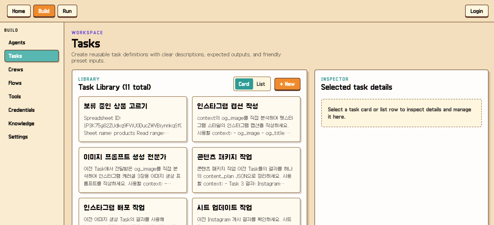
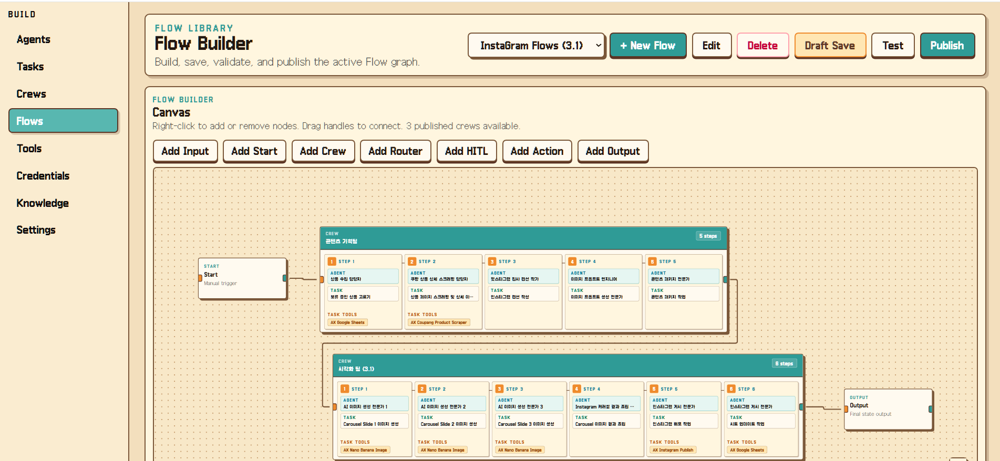
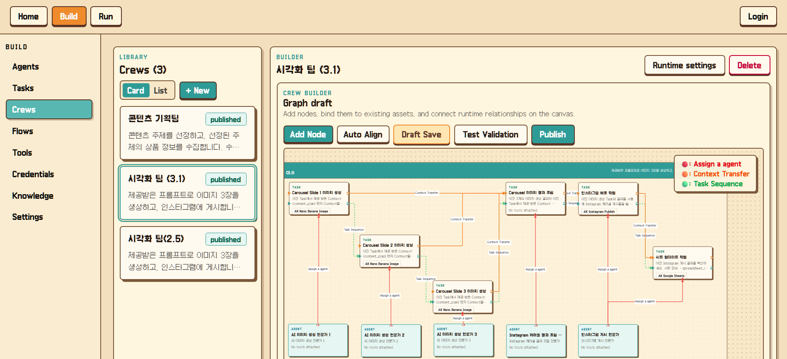

# AX Orchestration Platform

AX Orchestration Platform is a full-stack AI workflow builder for creating, connecting, publishing, and running multi-agent automation flows. It provides a visual workspace where users can compose Agents, Tasks, Crews, Tools, Knowledge sources, Credentials, and Flow execution nodes into reusable AI workflows.

This public repository is a portfolio-safe version of a private project. Secrets, local environments, build outputs, and internal work logs were removed before publication.

## Demo

[Watch the demo video](docs/media/ax-platform-demo.mp4)

## Product Screens

### Home Runner



### Flow Builder



### Crew Builder



### Run Launcher



### Agent Library



### Task Library



## What It Does

- Builds versioned AI assets: Agents, Tasks, Crews, Flows, Tools, Knowledge, and Credentials.
- Provides visual Crew and Flow builders based on graph editing.
- Publishes draft graphs into runtime snapshots for stable execution.
- Runs published workflows with streaming run events.
- Supports HITL review gates, execution actions, artifacts, and external tool integrations.
- Connects knowledge assets to runtime tools for RAG-style retrieval.
- Keeps frontend/backend API contracts aligned through OpenAPI-generated types.

## Architecture

```text
frontend/
  React 19, Vite, TanStack Query, React Flow, Pixi
  Feature pages for Agents, Tasks, Crews, Flows, Tools, Runs, Knowledge, Credentials

backend/
  FastAPI, SQLAlchemy, CrewAI runtime orchestration
  Routes, services, runtime loaders, event streaming, tool execution, auth boundary

docs/
  OpenAPI contract, architecture notes, tool integration guide, screenshots, demo media

data/
  Example and reference data only
```

## Core Flow

```text
Build UI
-> Draft graph
-> Publish validation
-> Runtime snapshot
-> Flow run
-> CrewAI execution / HITL / execution actions
-> Streaming events and artifacts
```

## Tech Stack

- Frontend: React, TypeScript, Vite, TanStack Query, React Flow, PixiJS
- Backend: Python, FastAPI, SQLAlchemy, Pydantic
- Runtime: CrewAI-style agent/task orchestration, graph loaders, run event pipeline
- Data: relational models, runtime snapshots, OpenAPI contracts
- Testing: frontend smoke tests and backend runtime/API tests

## Repository Highlights

- [`frontend/src/features/flows`](frontend/src/features/flows): Flow library, graph builder, node inspectors, runtime bindings.
- [`frontend/src/features/crews`](frontend/src/features/crews): Crew graph builder and versioned crew editing.
- [`frontend/src/features/runs`](frontend/src/features/runs): Run launch, stream handling, HITL dialogs, output preview.
- [`frontend/src/features/home`](frontend/src/features/home): Pixi-based home runner and live workflow visualization.
- [`backend/api/runtime`](backend/api/runtime): Crew/Flow runtime loaders, execution engine, credential resolution, events, artifacts.
- [`backend/api/routes`](backend/api/routes): FastAPI route layer.
- [`backend/api/services`](backend/api/services): Domain services for assets, graphs, runs, knowledge, credentials, tooling.
- [`docs/openapi.json`](docs/openapi.json): API contract snapshot.

## Local Setup

### Frontend

```bash
cd frontend
npm install
npm run dev
```

### Backend

```bash
cd backend
python -m venv .venv
.venv\Scripts\activate
pip install -r requirements.txt
uvicorn api.main:app --reload
```

Environment variables are intentionally not included in this public repository. Create local `.env` files from your own provider credentials before running external integrations.

## Tests

```bash
cd frontend
npm test
```

```bash
cd backend
pytest
```

## Public Release Notes

This repository was prepared for portfolio review:

- Removed private `.env` files.
- Removed `.git`, virtual environments, `node_modules`, caches, and build outputs.
- Removed internal planning logs from the public copy.
- Replaced secret-shaped test strings that triggered GitHub Push Protection.
- Added screenshots and a demo video under `docs/media`.

For a quick release checklist, see [`PUBLIC_RELEASE_CHECKLIST.md`](PUBLIC_RELEASE_CHECKLIST.md).
